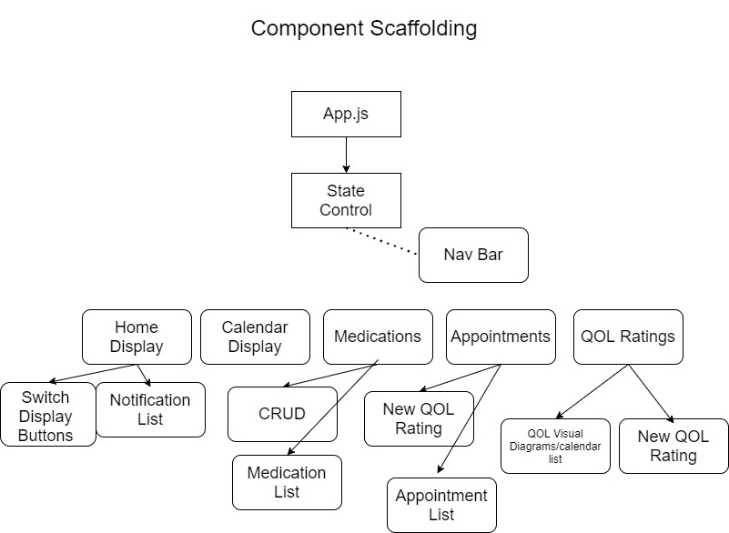

Project needs:

Capstone Proposal:
README: Project Overview

## Project Proposal / Overview
 _This application is intended to assist users in taking charge of and managing their health, by providing a centralized cloud-based solution for keeping track of, taking notes on, and mapping out, medications, medical appointments, and measuring day to day quality of life. The intended user of this application is someone dealing with chronic illness, or their caretaker. In order to make this accessible during medical appointments, application will be a mobile application._

 ## User Stories

 ### Medication List
 * As a user, I want to be able to create and manage a list of medications and supplements I am currently, or have previously been taking.
 * As a user, I want to be able to add new medications and supplements to the medication list.
 * As a user, I want to be able to remove medications and supplements from the medication list.
 * As a user, I want to be able to take notes on each medication/supplement, for the following fields: medication, prescribed by, prescribed date, purpose of prescribing, known side effects, dosage, quantity, frequency and amount of intake, and side effects I am experiencing/noticing.
 * As a user, I want to be able to update any medication/supplement list entry at any time.
 * As a user, I want any listing in my medication list, so long as I provide information regarding quantity and medication start date, to list when the medication will run out.

 ### Appointment List
 * As a user, I want to keep track of my past, present, and upcoming medical appointments.
 * As a user, I want to store the following information regarding a medical appointment: Date and time of Appointment, medical professional I will be meeting with, purpose of appointment, questions I have before the appointment, notes from/during appointment, takeaway/what's changed from the appointment (e.g., new medication).

 ### Daily QOL Notes
 * As a user, I want the ability to rate my Quality Of Life for any given day, using several metrics: pain, nausea, overall rating.
 * As a user, I want the ability to take notes on any particular day to keep track of anything I might need (e.g., number of bowel movements, localization of pain, food or activity that caused me to feel nauseaus).
 * As a user, I want the ability to look back at any day, or see my QOL ratings side-by-side for a given week or month (perhaps in color-coded calendar) to provide concrete context and evidence when speaking with my health providers.

 ### Calendar
 * As a user, I want the ability to access upcoming, current, and past QOL ratings, appointments, and notifications within a centralized calendar view.
 * As a user, I want the ability to sync prescription filling reminders, and medical appointments to my Google Calendar.

 ### Notifications/Upcoming
 * As a user, I want a portion in the application to remind me of upcoming medical appointments, medication refil reminders etc.
 * As a user, I want the application to remind me to submit a QOL rating for the day via push notifications on my mobile device, and within the device itself.

 ### API Consuming features
 * As a user, I want the option to pre-load information regarding a medication into my medication list entries when desired.
 * As a user, I want this applications calendar to sync with my Google Calendar.

 ## Diagrams

 ### Home Layout Mockup
 

 ### Component Scaffolding
  

  ## Technologies
  * React-native
  * JavaScript
  * React-redux
  * Redux
  * CSS
  * HTML
  * Flexbox
  * Bootstrap
  * Expo.io
  * Jest
  * API Calls
  * react-native-community/hooks
  * Firebase/Firestore

  ## ToDo List

  * Find API for Medication information
  * Study documentation for Google Calendar
  * Look into Calendars with firebase
  * Layout database structure (collections), and expected document values
  * Find React-native template, and view tag resource
  * Build the application!

  ## Stretch goals
  * View transition animations!!

  ## API Information

  * Drug Adverse Effects: https://open.fda.gov/apis/drug/event/

  ## Resources
  * React Native Tutorial: https://www.youtube.com/watch?v=0-S5a0eXPoc&ab_channel=ProgrammingwithMosh

  # ToDo List

  * Update Home Page/view with basic styling. 
    * Next Appointment listing
    * Next medication that needs to be refilled listing
    * Reminder if daily QoL rating hasn't been submitted
  *Add CRUD Functionality for..
    * Apps
    * Medications
    * QoL
  * Fix styling for NavBar
  * Find way for querying based on user auth. i.e., no getting other users data
  * project README!