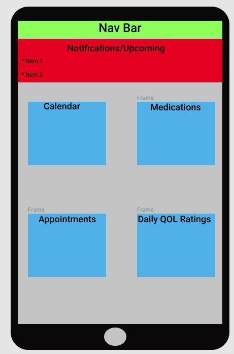

  
<h1 align='center'><br>


**<h1 align = 'center'>health-manager 4000!**


*<h2 align ='center'>Take Charge of Your Health Journey!*


<h3 align ='center'>•<a href='#requirements'> Requirements</a> •<a href='#setup'> Setup</a> •<a href='#technologies-used'> Technologies</a> •<a href='#author:'> Author</a> •<a href='#protecting-your-data'> Protecting Data</a> •<a href='#cloning'> Cloning</a></h3>


<h3 align='center'>An Epicodus Capstone project</h3>

# **Project Proposal / Overview**
 _This application is intended to assist users in taking charge of and managing their health, by providing a centralized cloud-based solution for keeping track of, taking notes on, and mapping out, medications, medical appointments, and measuring day to day quality of life. The intended user of this application is someone dealing with chronic illness, or their caretaker. In order to make this accessible during medical appointments, application will be a mobile application and store data in the Firestore cloud database._

   ### Sign In Page
  

# **REQUIREMENTS**

* This project uses the [expo cli](https://expo.io/)
* To launch and run this program, you will require an IOS/Android Emulator, or to download the expo cli app for your mobile device. 

# **SETUP**

* This project also requires an active firebase-firestore database. Please follow [these instructions](https://www.learnhowtoprogram.com/react/react-with-nosql/setting-up-a-firebase-project) to set up and create your Firestore database.
* Once your firestore databse is establishes, you will need to store your unique database api keys in a unique file detailed below.

## **CLONING**

* Copy the repo link as shown in the image below


* Paste the link in the field provided by VsCode as shown in the image below

* You will be prompted to open the directory once you have cloned it. Select 'open'


<br>

# **INSTALL**

## **INSTALLING WITH NODE**


with the root project folder open in your code editor, execute the following in your terminal:

``cd ProjectName``

``npm install``


<br>

# **PROTECTING YOUR DATA**

* After retrieving your database api keys as described in the link above, you must create a 'keys.js' file in the 'src' directory and sub in your keys as listed below:

```js
const keys = {
  REACT_APP_FIREBASE_API_KEY: "YOUR DB INFO HERE",
  REACT_APP_FIREBASE_AUTH_DOMAIN: "YOUR DB INFO HERE",
  REACT_APP_FIREBASE_DATABASE_URL: "YOUR DB INFO HERE",
  REACT_APP_FIREBASE_PROJECT_ID: "YOUR DB INFO HERE",
  REACT_APP_FIREBASE_STORAGE_BUCKET: "YOUR DB INFO HERE",
  REACT_APP_FIREBASE_MESSAGING_SENDER_ID: "YOUR DB INFO HERE",
  REACT_APP_FIREBASE_APP_ID: "YOUR DB INFO HERE",
}

export default keys;
```
<br>

  ### Home Page
 

 ## Known Bugs
 _In retrospect it seems that almost everything that could have gone wrong did go wrong with this project. For example, utilizing the .env file to store and access keys was not functioning, and useing the standard workaround with the package 'react-native-dotenv' prooved similarly innefective. Additionally, the projects Jest tests will not run. I am unsure as to why, but even with some instructor assistance we were not able to resolve this issue._

 _This project reminded me what it felt like to learn HTML all over again, as styling was a constant problem. Text on buttons will frequently not appear, and sizing buttons also proved somewhat difficult. As any user can see, styling is basic at best, and lacks the quality of a final finished product. However, I enjoyed working on this application as a learning experience._

 _Given the time constraints, I regularly had to decide on what could be ignored and what issues or components should be prioritized._

 ## If I started Again

 _If I were to restart this project, and had more time, I would first focus on finding and following along with an extensive React-native tutorial which builds out visual aspects, animations, and styling of a mobile app. Working on the application logic was not difficult and well within my capabilities. However, I very much enjoyed the challenge. Though stressful at times, this was a great learning project, and I am excited to work on more mobile applications in the future!_


 ## User Stories

 ### Medication List
 * As a user, I want to be able to create and manage a list of medications and supplements I am currently, or have previously been taking.
 * As a user, I want to be able to add new medications and supplements to the medication list.
 * As a user, I want to be able to remove medications and supplements from the medication list.
 * As a user, I want to be able to take notes on each medication/supplement, for the following fields: medication, prescribed by, prescribed date, purpose of prescribing, known side effects, dosage, quantity, frequency and amount of intake, and side effects I am experiencing/noticing.
 * As a user, I want to be able to update any medication/supplement list entry at any time.
 * As a user, I want any listing in my medication list, so long as I provide information regarding quantity and medication start date, to list when the medication will run out.

 ### Appointment List
 * As a user, I want to keep track of my past, present, and upcoming medical appointments.
 * As a user, I want to store the following information regarding a medical appointment: Date and time of Appointment, medical professional I will be meeting with, purpose of appointment, questions I have before the appointment, notes from/during appointment, takeaway/what's changed from the appointment (e.g., new medication).

 ### Daily QOL Notes
 * As a user, I want the ability to rate my Quality Of Life for any given day, using several metrics: pain, nausea, overall rating.
 * As a user, I want the ability to take notes on any particular day to keep track of anything I might need (e.g., number of bowel movements, localization of pain, food or activity that caused me to feel nauseaus).
 * As a user, I want the ability to look back at any day, or see my QOL ratings side-by-side for a given week or month (perhaps in color-coded calendar) to provide concrete context and evidence when speaking with my health providers.

 ### Calendar
 * As a user, I want the ability to access upcoming, current, and past QOL ratings, appointments, and notifications within a centralized calendar view.
 * As a user, I want the ability to sync prescription filling reminders, and medical appointments to my Google Calendar.

 ### Notifications/Upcoming
 * As a user, I want a portion in the application to remind me of upcoming medical appointments, medication refil reminders etc.
 * As a user, I want the application to remind me to submit a QOL rating for the day via push notifications on my mobile device, and within the device itself.

 ### API Consuming features
 * As a user, I want the option to pre-load information regarding a medication into my medication list entries when desired.
 * As a user, I want this applications calendar to sync with my Google Calendar.
 * As a user, I want the application to read my prescription labels and auto-populate a new prescription entry which I can then edit for accuracy.

   ### Add New Medication Form
 

 ## Diagrams

 ### Home Layout Mockup
 

 ### Component Scaffolding
 

  ## ToDo List

  * Find API for Medication information
  * Study documentation for Google Calendar
  * Look into Calendars with firebase
  * Layout database structure (collections), and expected document values
  * Find React-native template, and view tag resource
  * Build the application!

  ## Stretch goals
  * View transition animations!!

  ## API Information

  * Drug Adverse Effects: https://open.fda.gov/apis/drug/event/


  # ToDo List

  * Update Home Page/view with basic styling. 
    * Next Appointment listing
    * Next medication that needs to be refilled listing
    * Reminder if daily QoL rating hasn't been submitted
  *Add CRUD Functionality for..
    * Apps
    * Medications
    * QoL
  * Fix styling for NavBar
  * Find way for querying based on user auth. i.e., no getting other users data
  * project README!

 ### Daily QoL Rating List
  

# **TECHNOLOGIES USED**

_[Javascript](https://developer.mozilla.org/en-US/docs/Web/JavaScript)_

_[CSS](https://en.wikipedia.org/wiki/Cascading_Style_Sheets)_

_[Bootstrap](https://getbootstrap.com/)_

_[HTML](https://developer.mozilla.org/en-US/docs/Web/HTML)_

_[Node.js](https://nodejs.org/en/)_

_[Webpack](https://webpack.js.org/)_

_[Visual Studio Code](https://code.visualstudio.com/)_

_[React](https://reactjs.org/)_

_[React Native](https://reactnative.dev/)_

_[Redux](https://redux.js.org/)_

_[Firebase](https://firebase.google.com/)_

<br>

  ### Medication List
  

# **Author**

[<br /><sub><b>Ian Scott</b></sub>](https://www.linkedin.com/in/ian-scott-portland-or/)<br />

<br>

<br>

![alt text][logo]

[logo]: https://img.shields.io/bower/l/bootstrap 'MIT License'